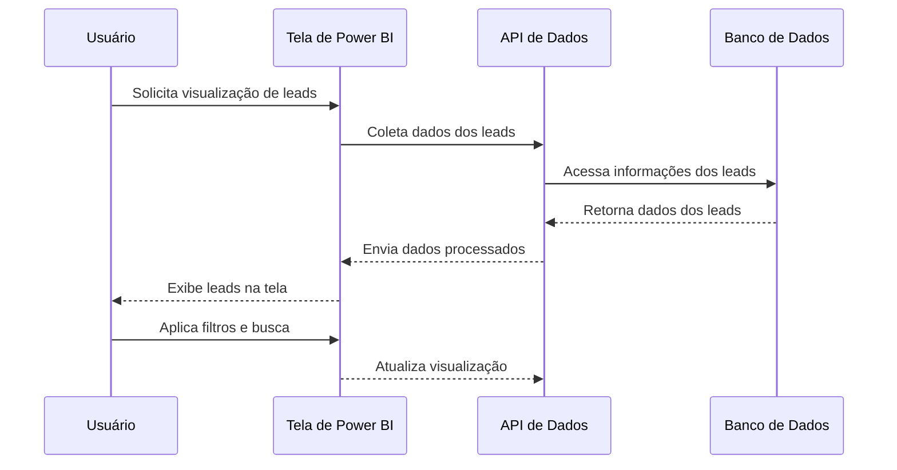

# 🔄 Fluxo de Dados

## Sumário
- [Sequência de Execução](#sequência-de-execução)
- [Detalhamento das Etapas](#detalhamento-das-etapas)
- [Diagrama de Sequência](#diagrama-de-sequência)

---

## Sequência de Execução

### Fluxo de Apresentação de Leads
1. **Coleta de Dados**: Dados dos leads são coletados de diferentes fontes.
2. **Processamento de Dados**: Os dados são transformados e organizados para visualização.
3. **Apresentação**: Os dados processados são exibidos na tela do Power BI.
4. **Interação do Usuário**: O usuário pode aplicar filtros e buscar leads específicos.
5. **Atualização de Dados**: A interface é atualizada em tempo real com novos dados.

### Fluxo de Análise
1. **Geração de Relatórios**: O sistema gera relatórios com base nos dados apresentados.
2. **Insights**: Análises são realizadas para fornecer insights sobre o desempenho dos leads.
3. **Exportação**: Os usuários podem exportar dados e relatórios para uso externo.

## Detalhamento das Etapas

### Apresentação de Leads
- **Coleta de Dados**: Integração com APIs e bancos de dados para coletar informações dos leads.
- **Processamento de Dados**: Transformação dos dados em um formato adequado para visualização no Power BI.
- **Apresentação**: Interface do Power BI exibe os dados de forma clara e interativa.
- **Interação do Usuário**: Usuários podem filtrar e buscar leads conforme necessário.
- **Atualização de Dados**: A interface é atualizada automaticamente com novos dados.

### Análise
- **Geração de Relatórios**: Relatórios são gerados automaticamente com base nos dados apresentados.
- **Insights**: Análises são realizadas para identificar tendências e padrões nos leads.
- **Exportação**: Opção para exportar dados e relatórios em formatos como CSV ou PDF.

## Diagrama de Sequência

