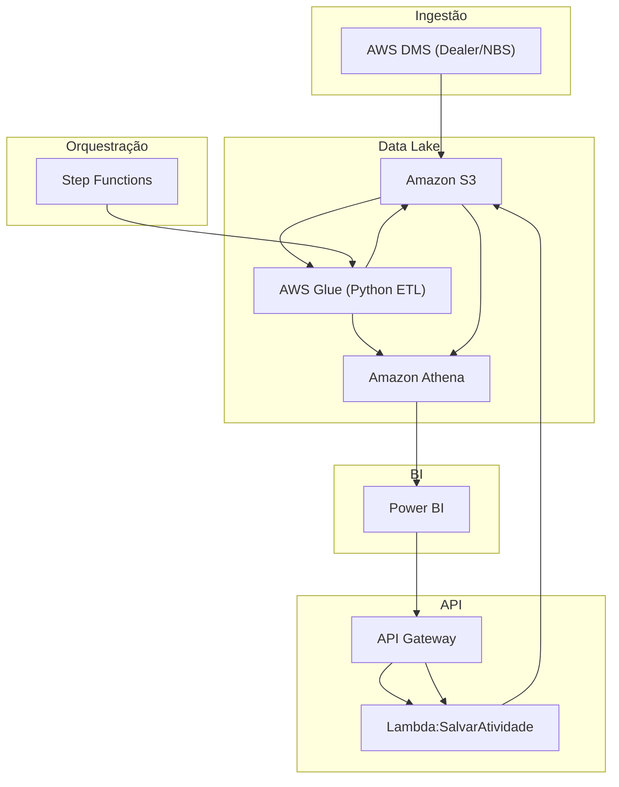

# 🏗️ Arquitetura
EXAMPLE CARTEIRA VENDENDOR
## Sumário
- [Visão de Componentes](#visão-de-componentes)  
- [Descrição dos Serviços](#descrição-dos-serviços)  
- [Diagrama de Componentes](#diagrama-de-componentes)

---

## Visão de Componentes

A arquitetura distribui-se em camadas:

1. **Ingestão**: AWS DMS & scripts → S3 raw  
2. **Processamento**: AWS Glue / Python → S3 stage/curated  
3. **Orquestração**: Step Functions & EventBridge  
4. **Catálogo**: Athena views  
5. **Consumo**: Power BI dashboards e API Lambda  

## Descrição dos Serviços

- **Amazon S3**: armazenamento raw, stage e curated.  
- **AWS Glue**: transformações ETL em Python.  
- **AWS Step Functions**: orquestração de pipelines.  
- **Amazon Athena**: consultas SQL e criação de views.  
- **AWS Lambda**: enpoint `carteiraVendedorSalvarAtividade`.  
- **API Gateway**: interface REST para Lambda.  
- **Power BI**: dashboards de consumo.

## Diagrama de Componentes

