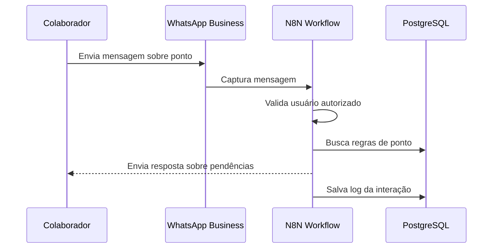

# 🔄 Fluxo de Dados

## Sumário
- [Sequência de Execução](#sequência-de-execução)
- [Detalhamento das Etapas](#detalhamento-das-etapas)
- [Diagrama de Sequência](#diagrama-de-sequência)

---

## Sequência de Execução

### Fluxo de Atendimento
1. **Recepção de Mensagem**: Colaborador envia mensagem via WhatsApp → captura pelo Webhook.
2. **Validação**: N8N valida usuário na base autorizada.
3. **Processamento**: N8N envia consulta para a base de conhecimento.
4. **Geração de Resposta**: N8N formula resposta baseada nas regras de ponto.
5. **Envio**: Mensagem formatada retorna ao colaborador via WhatsApp.
6. **Registro**: N8N salva log da interação no PostgreSQL.

## Detalhamento das Etapas

### Atendimento
- **Recepção de Mensagem**: Captura em tempo real via webhook WhatsApp.
- **Validação**: Verificação de autorização do usuário.
- **Processamento**: Envio de consulta para a base de conhecimento.
- **Geração de Resposta**: Resposta clara e objetiva sobre marcações.
- **Envio**: Mensagem enviada ao colaborador.
- **Registro**: Log inclui timestamp, usuário, pergunta e resposta.

## Diagrama de Sequência
