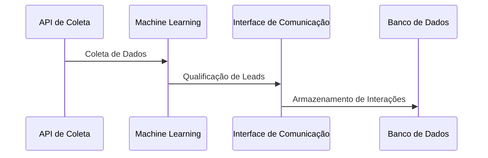

# 🔄 Fluxo de Dados

## Sumário
- [Sequência de Execução](#sequência-de-execução)
- [Detalhamento das Etapas](#detalhamento-das-etapas)
- [Diagrama de Sequência](#diagrama-de-sequência)

---

## Sequência de Execução
1. **Coleta de Dados**: A IA coleta informações de leads através de APIs.
2. **Análise de Dados**: Os dados coletados são processados por algoritmos de machine learning.
3. **Qualificação de Leads**: A IA classifica os leads com base em critérios definidos.
4. **Interação**: A IA interage com os leads qualificados através de e-mail ou mensagens.
5. **Armazenamento**: Os dados e interações são armazenados em um banco de dados.

## Detalhamento das Etapas
- **Coleta de Dados**: Integração com APIs para obter informações de leads.
- **Análise de Dados**: Processamento dos dados utilizando modelos de machine learning.
- **Qualificação de Leads**: Identificação de leads com maior potencial de conversão.
- **Interação**: Envio de mensagens automáticas para leads qualificados.
- **Armazenamento**: Registro de todas as interações e dados em um banco de dados.

## Diagrama de Sequência
