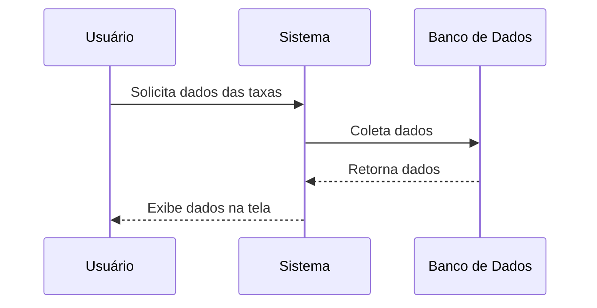

# 🔄 Fluxo de Dados

## Sumário
- [Sequência de Execução](#sequência-de-execução)
- [Detalhamento das Etapas](#detalhamento-das-etapas)
- [Diagrama de Sequência](#diagrama-de-sequência)

---

## Sequência de Execução

### Fluxo de Coleta de Taxas
1. **Coleta de Dados**: O sistema coleta dados de taxas diariamente.
2. **Processamento**: Os dados coletados são processados para análise.
3. **Exibição**: Os resultados são exibidos na interface do usuário.

### Fluxo de Exportação de Dados
1. **Seleção de Período**: O usuário seleciona o período desejado.
2. **Geração de Relatório**: O sistema gera um relatório com os dados filtrados.
3. **Download**: O usuário pode baixar o relatório gerado.

## Detalhamento das Etapas

### Coleta de Dados
- **Fonte de Dados**: [Descrever a fonte de dados, ex: API, Banco de Dados, etc.]
- **Frequência**: Dados coletados diariamente.

### Processamento
- **Métodos Utilizados**: [Descrever os métodos de processamento, ex: cálculos, agregações, etc.]

### Exibição
- **Interface**: Tela que mostra as taxas coletadas com gráficos interativos.

## Diagrama de Sequência

