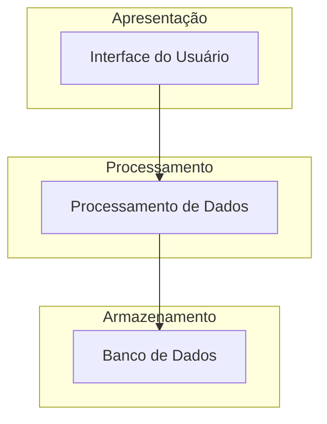

# 🏗️ Arquitetura

## Sumário
- [Visão de Componentes](#visão-de-componentes)
- [Descrição dos Serviços](#descrição-dos-serviços)
- [Diagrama de Componentes](#diagrama-de-componentes)

---

## Visão de Componentes

A arquitetura do projeto **Power BI Leads** distribui-se em camadas:

### Camada de Apresentação
1. **Interface do Usuário**: Tela de apresentação dos leads.

### Camada de Processamento
2. **Processamento de Dados**: Coleta e processamento dos dados dos leads.

### Camada de Armazenamento
3. **Banco de Dados**: Armazenamento das informações dos leads.

## Descrição dos Serviços

- **Interface do Usuário**: Apresenta os leads de forma visual e interativa.
- **Processamento de Dados**: Realiza a extração e transformação dos dados dos leads.
- **Banco de Dados**: Armazena informações sobre os leads e suas interações.

## Diagrama de Componentes
