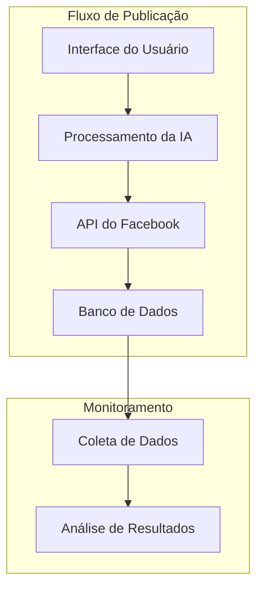

### 🏗️ Arquitetura

## Sumário
- [Visão de Componentes](#visão-de-componentes)
- [Descrição dos Serviços](#descrição-dos-serviços)
- [Diagrama de Componentes](#diagrama-de-componentes)

---

## Visão de Componentes

A arquitetura da **IA de Publicação de Anúncios no Facebook** distribui-se em camadas:

### Fluxo de Publicação
1. **Recepção**: Interface para entrada de dados do usuário (ex: parâmetros do anúncio).
2. **Processamento**: Lógica da IA que gera o conteúdo do anúncio.
3. **Integração com API**: Conexão com a API do Facebook para publicar anúncios.
4. **Armazenamento**: Registro de anúncios publicados e desempenho em banco de dados.

### Monitoramento
5. **Coleta de Dados**: Monitoramento do desempenho dos anúncios.
6. **Análise de Resultados**: Relatórios e insights sobre a eficácia das campanhas.

## Descrição dos Serviços

- **API do Facebook**: Gerenciamento de anúncios, criação de campanhas e análise de desempenho.
- **Banco de Dados**: Armazenamento de informações sobre anúncios e resultados.
- **Interface de Usuário**: Local onde os usuários podem inserir dados e visualizar resultados.

## Diagrama de Componentes

