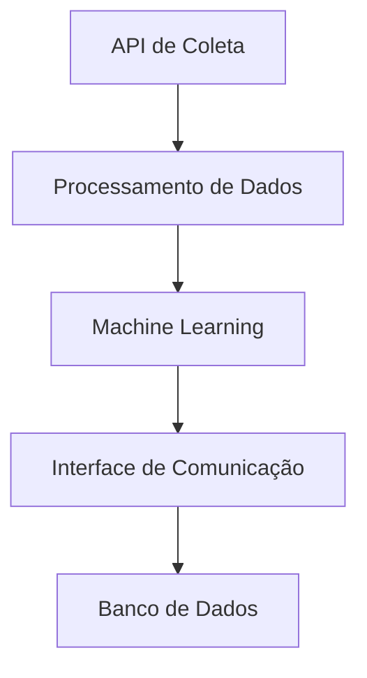

# 🏗️ Arquitetura

## Sumário
- [Visão de Componentes](#visão-de-componentes)
- [Descrição dos Serviços](#descrição-dos-serviços)
- [Diagrama de Componentes](#diagrama-de-componentes)

---

## Visão de Componentes

A arquitetura da **IA de Prospecção** distribui-se em camadas:

### Camadas do Sistema
1. **Coleta de Dados**: Integração com APIs e bancos de dados para coleta de informações de leads.
2. **Processamento**: Algoritmos de machine learning para análise e qualificação de leads.
3. **Interação**: Interface de comunicação com potenciais clientes via e-mail ou mensagens.
4. **Armazenamento**: Banco de dados para armazenamento de leads e histórico de interações.

## Descrição dos Serviços

- **APIs de Coleta**: Conexão com fontes de dados externas para obter informações relevantes.
- **Machine Learning**: Modelos que analisam dados e identificam leads qualificados.
- **Interface de Comunicação**: Sistema que permite a interação com os leads através de múltiplos canais.

## Diagrama de Componentes

