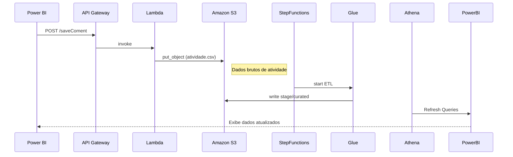

# 🔄 Fluxo de Dados
EXAMPLE CARTEIRA VENDENDOR
## Sumário
- [Sequência de Execução](#sequência-de-execução)  
- [Detalhamento das Etapas](#detalhamento-das-etapas)  
- [Diagrama de Sequência](#diagrama-de-sequência)

---

## Sequência de Execução

1. **DMS Replication**: Dealer/NBS → S3 raw  
2. **Glue ETL**: raw → stage → curated  
3. **Step Functions**: orquestração e retries  
4. **Athena CTAS**: criação de views  
5. **Power BI Refresh**: dashboards atualizados  
6. **API Lambda**: registro de atividade de vendedor

## Detalhamento das Etapas

- **DMS Replication**: configurações de replicação full/incremental.  
- **Glue ETL**: scripts Python para transformação e enriquecimento.  
- **Step Functions**: monitoramento e tratamento de erros.  
- **Athena CTAS**: materializa views em tabelas gerenciadas.  
- **Power BI Refresh**: executa nos horários agendados.  
- **API Lambda**: operação síncrona de CRUD de atividades.

## Diagrama de Sequência

