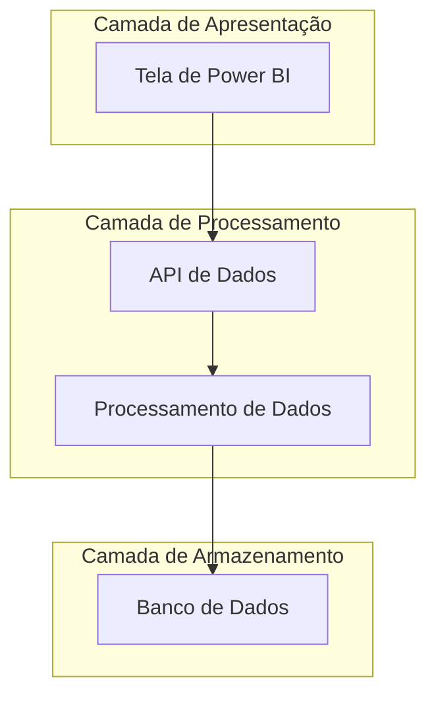

# 🏗️ Arquitetura

## Sumário
- [Visão de Componentes](#visão-de-componentes)
- [Descrição dos Serviços](#descrição-dos-serviços)
- [Diagrama de Componentes](#diagrama-de-componentes)

---

## Visão de Componentes

A arquitetura da **Tela de Power BI - Leads** é estruturada em camadas:

### Camada de Apresentação
1. **Interface do Usuário**: Tela de Power BI que mostra todos os leads.
2. **Interatividade**: Filtros e opções de busca para facilitar a navegação.

### Camada de Processamento
1. **Processamento de Dados**: Coleta e transformação de dados de diferentes fontes.
2. **Análise de Dados**: Geração de relatórios e insights sobre leads.

### Camada de Armazenamento
1. **Banco de Dados**: Armazenamento de informações dos leads.

## Descrição dos Serviços

- **Power BI**: Ferramenta de visualização de dados para análise de leads.
- **API de Dados**: Integração com diferentes fontes de dados.
- **Banco de Dados**: Armazenamento e gerenciamento de informações dos leads.

## Diagrama de Componentes
