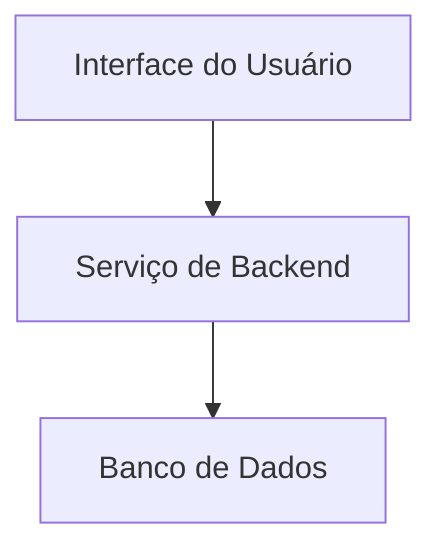

# 🏗️ Arquitetura

## Sumário
- [Visão de Componentes](#visão-de-componentes)
- [Descrição dos Serviços](#descrição-dos-serviços)
- [Diagrama de Componentes](#diagrama-de-componentes)

---

## Visão de Componentes
A arquitetura do **[Nome do Projeto]** distribui-se em camadas:

### Componentes Principais
1. **Interface do Usuário**: Tela que exibe as taxas coletadas.
2. **Serviço de Backend**: Processa e fornece os dados das taxas.
3. **Banco de Dados**: Armazena as informações sobre as taxas.

## Descrição dos Serviços
- **Frontend**: Desenvolvido em [tecnologia utilizada, ex: React, Angular, etc.], responsável pela interação do usuário.
- **API**: [Descrição da API utilizada, se houver].
- **Banco de Dados**: [Tipo de banco de dados, ex: PostgreSQL, MySQL, etc.].

## Diagrama de Componentes

