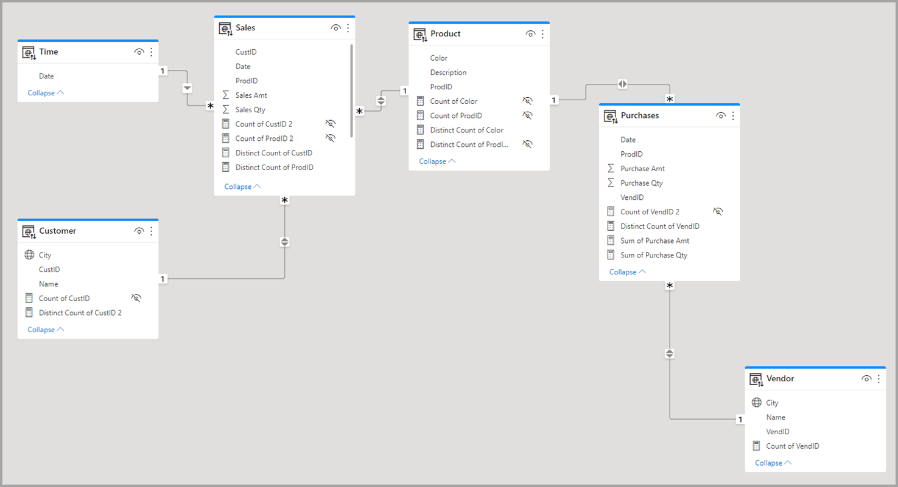

#  Modelo de Dados e Relacionamentos

Esta seção descreve a estrutura do modelo de dados utilizado no Power BI, incluindo as tabelas, colunas e os relacionamentos entre elas.

## Diagrama do Modelo

Incorpore uma imagem do diagrama de relacionamentos do Power BI. Isso oferece uma visão clara e rápida de como as tabelas se conectam.

*Exportar a imagem da aba "Modelo" no Power BI Desktop.*

## Dicionário de Tabelas

### Tabela Fato: `fVendas`

-   **Descrição:** Tabela principal que contém os registros transacionais de vendas.
-   **Granularidade:** Cada linha representa um item de uma venda.
| Coluna | Tipo de Dado | Descrição |
| :--- | :--- | :--- |
| `id_venda` | Inteiro | Identificador único da venda. |
| `id_produto`| Inteiro | Chave estrangeira para a `dProduto`. |
| `id_vendedor`| Inteiro | Chave estrangeira para a `dVendedor`. |
| `data_venda`| Data | Chave estrangeira para a `dCalendario`. |
| `valor_item`| Decimal | Valor do item vendido. |
| `qtd_item` | Inteiro | Quantidade de itens vendidos. |

### Tabela Dimensão: `dProduto`

-   **Descrição:** Tabela com os atributos dos produtos.
-   **Chave Primária:** `id_produto`

| Coluna | Tipo de Dado | Descrição |
| :--- | :--- | :--- |
| `id_produto`| Inteiro | Identificador único do produto. |
| `nome_produto`| Texto | Nome do produto. |
| `categoria` | Texto | Categoria do produto. |

*(Continue listando as outras tabelas dimensão, como `dCalendario`, `dVendedor`, etc.)*