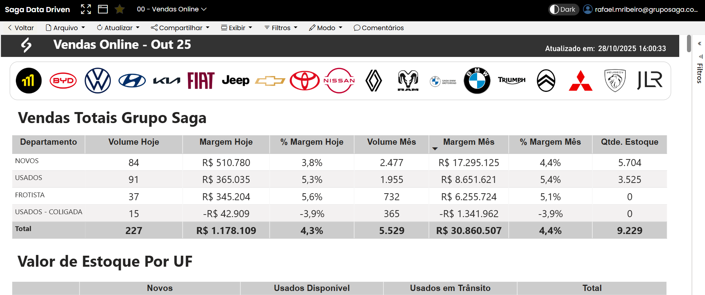

# 📄 Telas do Relatório

Esta seção detalha cada tela (página) do relatório no Power BI, explicando seu propósito e os principais visuais.

---
## Tela 1: Análise de Oportunidades (Exemplo)

-   **ID da Tela:** `PG-01`
-   **Propósito:** Fornecer uma visão completa do funil de vendas, analisando o volume, valor e características das oportunidades de negócio.
-   **Público-alvo:** Diretores, Gerentes de Venda e Vendedores.

### Imagem da Tela Catalogada

### Detalhamento dos Visuais

A seguir, cada visual numerado na imagem é detalhado.

| # | Título do Visual | Tipo | Descrição e Propósito |
| :--- | :--- | :--- | :--- |
| **1.1** | Opportunity Count | Cartão (Card) | **KPI Principal:** Exibe o número total de oportunidades abertas no período selecionado. |
| **1.2** | Opportunity Count by Partner Driven, Opportunity Size | Gráfico de Colunas | Compara a quantidade de oportunidades entre as que foram (`Yes`) e não foram (`No`) originadas por parceiros, segmentado por porte (Pequeno, Médio, Grande). |
| **1.3** | Opportunity Count by Partner Driven, Sales Stage...| Gráfico de Colunas | Detalha a contagem de oportunidades por estágio do funil, comparando a origem (parceiro ou não). |
| **1.4** | Opportunity Count by Region | Gráfico de Pizza | Mostra a distribuição percentual de oportunidades entre as regiões de venda (Leste, Central, Oeste). |
| **1.5** | Revenue | Cartão (Card) | **KPI Principal:** Exibe a receita total potencial de todas as oportunidades. |
| **1.6** | Sales Stage by Month, Sales Stage | Gráfico de Colunas 100% Empilhadas | Analisa a evolução da composição do funil de vendas mês a mês, mostrando a proporção de cada estágio. |
| **1.7** | Opportunity Count by Region, Opportunity Size | Gráfico de Barras | Compara o volume de oportunidades por região, segmentado pelo porte da oportunidade. |
| **1.8** | Opportunity Count by Sales Stage | Gráfico de Funil | Ilustra a conversão de oportunidades através das etapas do funil de vendas. |
| **1.9** | Average Revenue by Partner Driven, Opportunity Size | Gráfico de Colunas | Compara a receita média das oportunidades por porte, analisando o impacto da origem (parceiro ou não). |
| **1.10** | Revenue by Sales Stage, Partner Driven | Gráfico de Colunas | Mostra o valor total da receita em cada estágio do funil, segmentado pela origem da oportunidade. |
| **1.11** | Average Revenue by Partner Driven, Opportunity Size | Gráfico de Barras | Apresenta a mesma análise do item 1.9, mas com uma visualização em barras para facilitar a comparação entre 'Yes' e 'No' dentro de cada porte. |
| **1.12** | Factored Revenue | Cartão (Card) | **KPI Principal:** Exibe a receita ponderada, que é o valor da receita multiplicado pela probabilidade de fechamento de cada estágio do funil. |
| **1.13** | Factored Revenue by Opportunity Size | Gráfico de Colunas | Mostra a contribuição da receita ponderada por cada porte de oportunidade. |