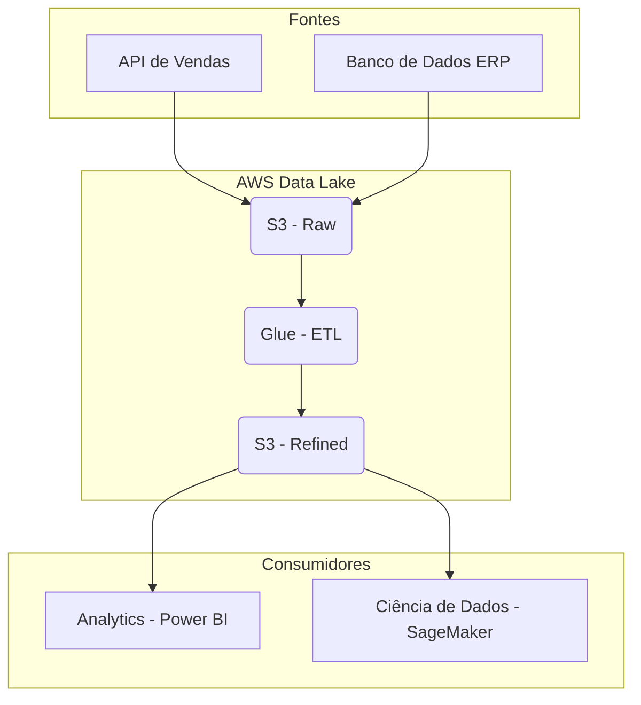

# 📖 Visão Geral e Arquitetura

## Propósito do Projeto

Descreva o principal objetivo de negócio que este projeto de dados resolve. Qual problema estamos solucionando ou qual oportunidade estamos buscando?

**Exemplo:** *Este projeto visa centralizar os dados de vendas de diversas fontes em um Data Lake, criando uma fonte única da verdade (Single Source of Truth) para alimentar relatórios de performance e modelos de previsão.*

## Arquitetura de Alto Nível

Insira um diagrama que ilustre o fluxo de dados de ponta a ponta, desde as fontes até os consumidores finais. Destaque os principais componentes da arquitetura.

Stakeholders
Nome	Área	Papel no Projeto
[Nome]	[Ex: Vendas]	Product Owner
[Nome]	[Ex: Dados]	Tech Lead
[Nome]	[Ex: Analytics]	Consumidor Principal