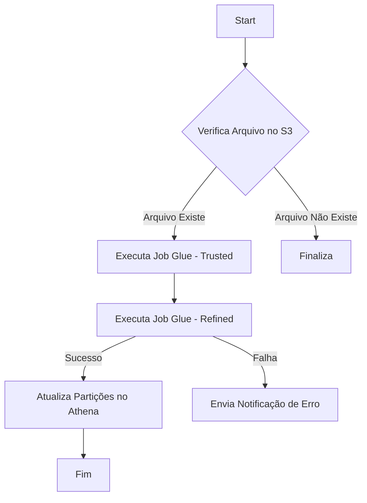

# 🏃 Pipelines

Esta seção documenta os pipelines orquestrados que executam os processos de ETL.

## Diagrama do Pipeline Principal

Use um diagrama para ilustrar o fluxo de execução, mostrando a ordem das tarefas e suas dependências.

Pipeline 1: [Nome, ex: Ingestão Diária de Vendas]
Orquestrador: AWS Step Functions

Gatilho (Trigger): Agendado (EventBridge Cron) - Diariamente às 03:00 AM.

Descrição: Este pipeline orquestra todo o processo de ETL dos dados de vendas, desde a camada bruta até a refinada.

Link para o Orquestrador: [Link para a State Machine no console da AWS]

Passos Principais
Validação de Arquivos: Verifica se os arquivos de origem esperados existem na camada raw.

Execução do Job Trusted: Dispara o job do Glue responsável por limpar e padronizar os dados.

Execução do Job Refined: Após o sucesso do job anterior, dispara o job que aplica as regras de negócio e modela os dados.

Atualização do Catálogo: Executa um crawler ou comando MSCK REPAIR TABLE para atualizar as partições no Athena.