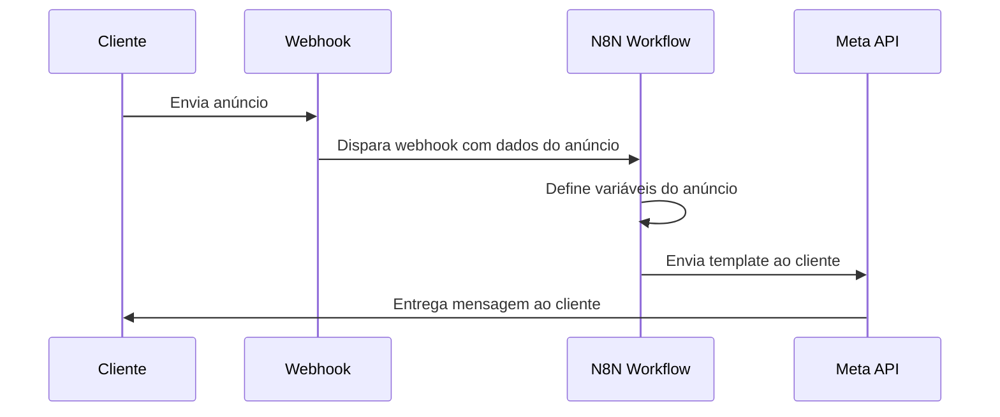

# Exemplo de Workflow: Publicação de Anúncios

---

## Objetivo do Fluxo

O workflow `Publicação_Anúncios` é acionado por um webhook, escuta os anúncios, mapeia as variáveis e envia uma mensagem ao cliente utilizando um template da Meta.

## Estrutura do Workflow

1. **Webhook (Trigger):**
   - **Nome do Nó:** "Recebe Anúncio via Webhook"
   - **Descrição:** Ponto de entrada para novos anúncios.

2. **Set:**
   - **Nome do Nó:** "Define Variáveis do Anúncio"
   - **Descrição:** Extrai e formata os dados do anúncio para uso nos passos seguintes.

3. **HTTP Request:**
   - **Nome do Nó:** "Envia Mensagem ao Cliente"
   - **Descrição:** Faz uma chamada para a API da Meta para enviar o template ao número do cliente.
   - **Credencial Usada:** Credenciais configuradas para a API Meta.

## Tratamento de Erro

- Um nó `Error Trigger` está configurado para capturar qualquer falha no fluxo.
- Em caso de erro, uma notificação é enviada para a equipe responsável.

## Diagrama de Sequência do Workflow: Publicação de Anúncios

