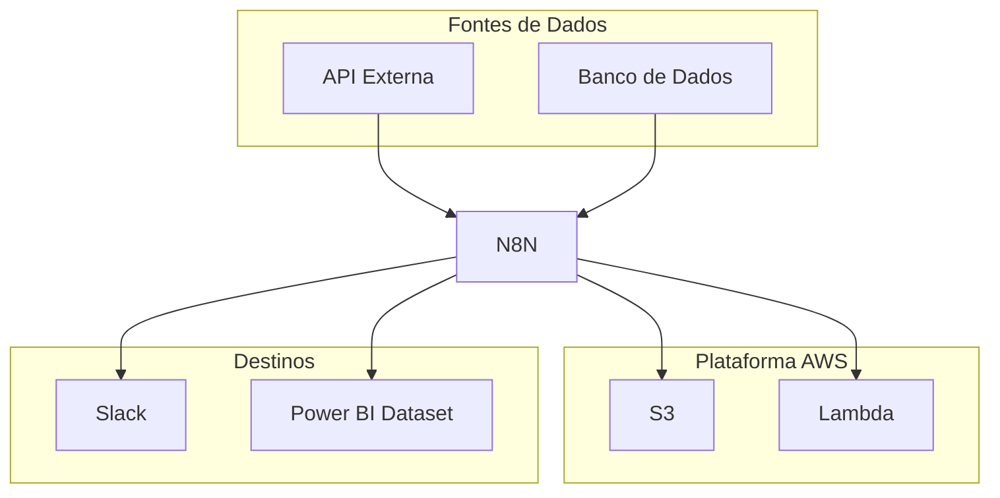

# Visão Geral das Integrações

Este documento fornece uma visão geral de todas as integrações utilizadas nos workflows do n8n.

## Diagrama de Integrações

Inclua um diagrama de alto nível que ilustre como o n8n se conecta com outros sistemas e serviços.

Resumo das Integrações
Sistema	Tipo	Direção	Propósito
[Nome do Sistema]	API REST	Entrada	[Ex: Obter dados de vendas]
AWS S3	SDK	Saída	[Ex: Armazenar dados processados]
Slack	Webhook	Saída	[Ex: Enviar notificações de status]

